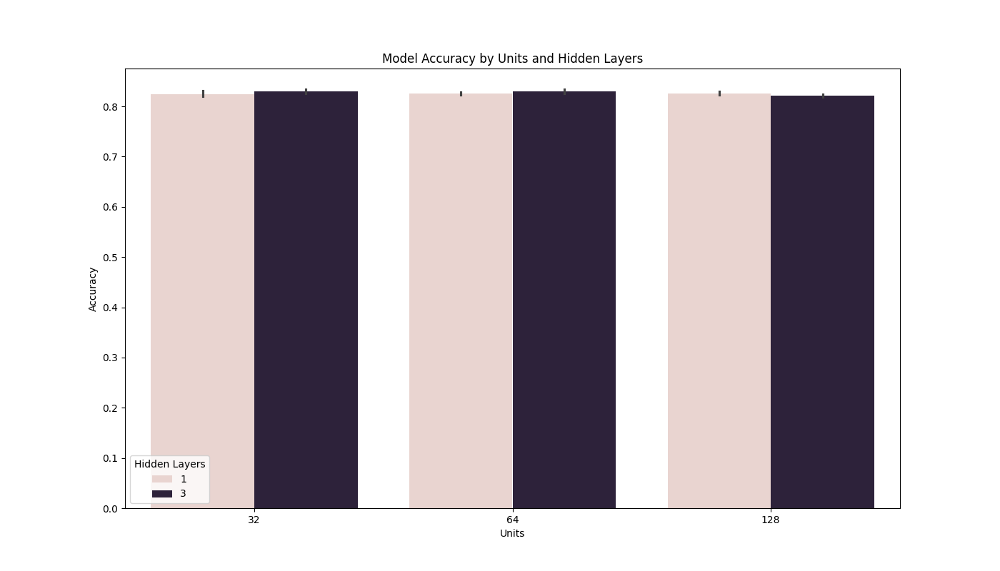

# Assignment 1: Neural Networks

## Introduction
The purpose of this assignment was to explore and extend the initial neural network model used on the IMDB dataset to improve its performance.

## Methodology
We experimented with different configurations, including:
- Number of hidden layers: 1, 3
- Number of units: 32, 64, 128
- Activation functions: relu, tanh
- Loss functions: binary_crossentropy, mse

## Results
The summarized results of our experiments are as follows:

| Hidden Layers | Units | Activation | Loss | Accuracy |
|---------------|-------|------------|------|----------|
| 1             | 32    | relu       | binary_crossentropy | 0.83332 |
| 1             | 32    | relu       | mse                | 0.82760 |
| 1             | 32    | tanh       | binary_crossentropy | 0.81832 |
| 1             | 32    | tanh       | mse                | 0.83264 |
| 1             | 64    | relu       | binary_crossentropy | 0.83096 |
| 1             | 64    | relu       | mse                | 0.82732 |
| 1             | 64    | tanh       | binary_crossentropy | 0.81712 |
| 1             | 64    | tanh       | mse                | 0.82292 |
| 1             | 128   | relu       | binary_crossentropy | 0.83152 |
| 1             | 128   | relu       | mse                | 0.82604 |
| 1             | 128   | tanh       | binary_crossentropy | 0.82220 |
| 1             | 128   | tanh       | mse                | 0.81020 |
| 3             | 32    | relu       | binary_crossentropy | 0.83204 |
| 3             | 32    | relu       | mse                | 0.83496 |
| 3             | 32    | tanh       | binary_crossentropy | 0.82848 |
| 3             | 32    | tanh       | mse                | 0.82876 |
| 3             | 64    | relu       | binary_crossentropy | 0.82940 |
| 3             | 64    | relu       | mse                | 0.83044 |
| 3             | 64    | tanh       | binary_crossentropy | 0.82580 |
| 3             | 64    | tanh       | mse                | 0.81348 |
| 3             | 128   | relu       | binary_crossentropy | 0.82928 |
| 3             | 128   | relu       | mse                | 0.81540 |
| 3             | 128   | tanh       | binary_crossentropy | 0.80540 |
| 3             | 128   | tanh       | mse                | 0.82128 |

## Visualizations
### Accuracy by Units and Hidden Layers

### Accuracy by Activation Function and Loss Function

